# 📘 Day 1 Setup Wiki - Software Engineering Mastery Journey

## 🎯 Executive Summary

**Objective:** Establish a professional-grade development environment for a 24-week software engineering mastery journey  
**Duration:** 6-8 hours  
**Status:** ✅ **COMPLETED SUCCESSFULLY**  
**System:** Windows 10 Home with WSL 2 backend  

---

## 📊 Setup Overview

```mermaid
graph TD
    A[🐍 Python 3.11.7] --> B[📦 Poetry]
    B --> C[🔧 Git & GitHub]
    C --> D[💻 VS Code + Extensions]
    D --> E[🐳 Docker Desktop]
    E --> F[🗄️ Databases]
    F --> G[📁 Workspace Setup]
    G --> H[🧪 Test Project]
    
    F --> F1[PostgreSQL:5432]
    F --> F2[Redis:6379] 
    F --> F3[MongoDB:27017]
    
    style A fill:#306998
    style B fill:#3776ab
    style D fill:#007ACC
    style E fill:#2496ED
    style F fill:#336791
```



---

## 🛠️ Tools & Technologies Installed

| Category | Tool | Version | Purpose | Status |
|----------|------|---------|---------|--------|
| **Language** | Python | 3.11.7 | Core programming language | ✅ |
| **Package Manager** | Poetry | 2.1.3 | Dependency & virtual env management | ✅ |
| **Version Control** | Git | Latest | Source code management | ✅ |
| **IDE** | VS Code | Latest | Primary development environment | ✅ |
| **Containerization** | Docker Desktop | Latest | Application containers | ✅ |
| **Database** | PostgreSQL | 15 | Relational database | ✅ |
| **Cache/Queue** | Redis | Latest | In-memory data store | ✅ |
| **NoSQL** | MongoDB | Latest | Document database | ✅ |

---

## 🚧 Issues Encountered & Solutions

### 🔧 Issue 1: Poetry Command Not Recognized
**Problem:** After installing Poetry via pip, `poetry --version` returned "command not recognized"  
**Root Cause:** Windows PATH not updated with Poetry's installation directory  
**Solution:**
```powershell
# Added Poetry Scripts directory to PATH
$poetryScriptsPath = "C:\Users\shiva\AppData\Roaming\Python\Python313\Scripts"
[Environment]::SetEnvironmentVariable("PATH", $currentPath + ";" + $poetryScriptsPath, [EnvironmentVariableTarget]::User)
```
**Lesson Learned:** Windows PATH updates require session refresh or manual PATH modification

### 🔧 Issue 2: GitHub CLI Not Found
**Problem:** `gh auth login` command not recognized after installation  
**Root Cause:** Similar PATH issue - GitHub CLI not added to system PATH  
**Solution:** Restart terminal and verify installation path, add to PATH if needed  
**Alternative:** Use GitHub Desktop for GUI-based Git operations

### 🔧 Issue 3: Hyper-V Not Available
**Problem:** Windows 10 Home doesn't support Hyper-V containers feature  
**Root Cause:** Hyper-V is only available on Windows Pro/Enterprise editions  
**Solution:** Used WSL 2 backend for Docker Desktop  
**Outcome:** WSL 2 actually provides better performance for development

### 🔧 Issue 4: PostgreSQL Container Startup Failure
**Problem:** PostgreSQL container failed to start, only Redis and MongoDB running  
**Root Cause:** Multi-line PowerShell commands didn't pass environment variables correctly  
**Solution:**
```powershell
# Used single-line command instead of multi-line with backslashes
docker run --name postgres-dev -e POSTGRES_PASSWORD=devpassword -e POSTGRES_DB=devdb -p 5432:5432 -d postgres:15
```
**Lesson Learned:** PowerShell uses backticks (`) for line continuation, not backslashes (\)

### 🔧 Issue 5: Poetry Shell Command Deprecated
**Problem:** `poetry shell` command not available in Poetry 2.0+  
**Root Cause:** Poetry 2.0+ removed shell command by default  
**Solution:** Use `poetry run` for executing commands in virtual environment  
**Best Practice:** `poetry run python main.py` instead of activating shell

### 🔧 Issue 6: Invalid TOML File from PowerShell
**Problem:** Poetry couldn't parse manually created pyproject.toml  
**Root Cause:** PowerShell's `Out-File` added BOM (Byte Order Mark) to file  
**Solution:**
```powershell
# Used UTF8NoBOM encoding
[System.IO.File]::WriteAllText("pyproject.toml", $content, [System.Text.UTF8Encoding]::new($false))
```
**Alternative:** Create files in VS Code to avoid encoding issues

---

## 🏗️ System Architecture


---

## 📚 Tool Deep Dive & Rationale

### 🐍 **Python 3.11.7**
**Why This Version:**
- **Latest Stable:** 3.11 series offers performance improvements (10-60% faster than 3.10)
- **Type Hints:** Enhanced typing support for better code quality
- **Error Messages:** Improved error reporting for faster debugging
- **Long-term Support:** Will be supported until 2027

**Industry Context:**
- Used by 87% of Fortune 500 companies
- Primary language for AI/ML, web development, automation
- Essential for backend development and data science

### 📦 **Poetry (Dependency Management)**
**Why Poetry over pip:**
- **Deterministic Builds:** `poetry.lock` ensures consistent dependency versions
- **Virtual Environment Management:** Automatic environment creation and management
- **Dependency Resolution:** Solves complex dependency conflicts automatically
- **Publishing Ready:** Built-in support for PyPI publishing

**Professional Impact:**
- Standard in modern Python projects
- Required for enterprise development
- Essential for microservices architecture

### 🔧 **Git & GitHub**
**Why These Tools:**
- **Industry Standard:** 95% of software companies use Git
- **Distributed Version Control:** Works offline, multiple backup locations
- **Collaboration:** Essential for team development
- **Integration:** Connects with all major CI/CD platforms

**Professional Skills:**
- Version control is fundamental to software engineering
- GitHub contributions showcase your skills to employers
- Required for open source participation

### 💻 **VS Code**
**Why VS Code over other IDEs:**
- **Free & Open Source:** No licensing costs
- **Extensible:** 45,000+ extensions available
- **Performance:** Lightweight yet powerful
- **Remote Development:** WSL, SSH, and container support
- **IntelliSense:** Advanced code completion and error detection

**Key Extensions Installed:**
- **Python:** Full Python language support
- **Black Formatter:** Code formatting (industry standard)
- **MyPy:** Static type checking
- **Docker:** Container management
- **GitHub Copilot:** AI-powered code completion (optional)

### 🐳 **Docker Desktop**
**Why Containerization:**
- **Environment Consistency:** "Works on my machine" problem solved
- **Microservices:** Essential for modern architecture
- **DevOps Integration:** Standard in CI/CD pipelines
- **Cloud Deployment:** Containers are cloud-native technology

**WSL 2 Backend Benefits:**
- **Better Performance:** Faster file system operations
- **Lower Resource Usage:** More efficient than Hyper-V
- **Linux Compatibility:** Access to Linux tools and environments
- **Windows Integration:** Seamless Windows-Linux workflow

### 🗄️ **Database Stack**

#### **PostgreSQL (Relational Database)**
**Why PostgreSQL:**
- **ACID Compliance:** Guaranteed data consistency
- **Advanced Features:** JSON support, full-text search, GIS capabilities
- **Scalability:** Handles enterprise-level workloads
- **Open Source:** No licensing fees, community-driven development

**Use Cases:**
- Primary application database
- Complex relational data
- Financial and transactional systems
- Data analytics and reporting

#### **Redis (In-Memory Data Store)**
**Why Redis:**
- **Speed:** Sub-millisecond response times
- **Versatility:** Cache, session store, message broker, real-time analytics
- **Data Structures:** Support for strings, hashes, lists, sets, sorted sets
- **Persistence:** Optional data durability

**Use Cases:**
- Application caching
- Session management
- Real-time leaderboards
- Message queues and pub/sub

#### **MongoDB (Document Database)**
**Why MongoDB:**
- **Flexible Schema:** Adapt to changing requirements
- **JSON-like Documents:** Natural fit for web applications
- **Horizontal Scaling:** Built-in sharding support
- **Rich Query Language:** Complex queries on nested documents

**Use Cases:**
- Content management systems
- Real-time analytics
- Internet of Things (IoT)
- Mobile applications

---

## 🎯 **Professional Development Workflow**


---

## ✅ **Verification Checklist**

### **Core Environment**
- [x] Python 3.11.7 installed and accessible
- [x] Poetry managing dependencies in virtual environment
- [x] Git configured with user credentials
- [x] VS Code with essential extensions active

### **Development Tools**
- [x] Docker Desktop running with WSL 2 backend
- [x] PostgreSQL container accessible on localhost:5432
- [x] Redis container accessible on localhost:6379
- [x] MongoDB container accessible on localhost:27017

### **Project Setup**
- [x] Test project created with Poetry
- [x] FastAPI and Uvicorn installed in virtual environment
- [x] VS Code using Poetry's Python interpreter
- [x] Sample application runs successfully

### **Professional Standards**
- [x] Virtual environment isolation
- [x] Dependency management with poetry.lock
- [x] Code formatting with Black
- [x] Type checking with MyPy
- [x] Version control ready

---

## 🚀 **Next Steps (Day 2 Preview)**

| Task | Description | Estimated Time |
|------|-------------|---------------|
| **Master Repository** | Create structured learning repository | 45 min |
| **Project Templates** | Set up reusable project scaffolding | 60 min |
| **Pre-commit Hooks** | Automate code quality checks | 30 min |
| **Documentation** | Establish documentation framework | 45 min |

---

## 📖 **Key Learnings**

### **Technical Skills Gained:**
1. **Environment Management:** Understanding of virtual environments and dependency isolation
2. **Containerization:** Docker basics and database container management
3. **Development Workflow:** Professional IDE setup with linting and formatting
4. **System Integration:** WSL 2 and Windows development environment harmony

### **Problem-Solving Skills:**
1. **PATH Management:** Understanding Windows environment variables
2. **Debugging:** Systematic approach to troubleshooting installation issues
3. **Alternative Solutions:** Finding workarounds when primary methods fail
4. **Documentation:** Recording solutions for future reference

### **Professional Practices:**
1. **Tool Selection:** Understanding why specific tools are industry standards
2. **Best Practices:** Following professional development conventions
3. **Environment Consistency:** Creating reproducible development setups
4. **Quality Assurance:** Implementing automated code quality checks

---

## 🎉 **Success Metrics Achieved**

- ✅ **100% Environment Setup** - All planned tools installed and verified
- ✅ **Professional Standards** - Industry-standard development workflow established  
- ✅ **Problem Resolution** - All technical challenges overcome
- ✅ **Documentation** - Complete record of setup process and solutions
- ✅ **Future Readiness** - Environment prepared for 24-week learning journey

---

## 🔗 **Quick Reference Commands**

### **Daily Development Workflow**
```powershell
# Navigate to development workspace
cd D:\Software_Engineering_Resources\Course\Development

# Create new project
mkdir new-project && cd new-project
poetry init --name new-project --version 0.1.0

# Add dependencies
poetry add fastapi uvicorn

# Run application
poetry run python main.py

# Database access
docker exec -it postgres-dev psql -U postgres -d devdb
docker exec -it redis-dev redis-cli
docker exec -it mongo-dev mongosh
```

### **Container Management**
```powershell
# Check running containers
docker ps

# View container logs
docker logs postgres-dev

# Start/stop containers
docker start postgres-dev
docker stop postgres-dev

# Remove containers (if needed)
docker rm postgres-dev
```

---

**📅 Date Completed:** Day 1 of Software Engineering Mastery Journey  
**⏱️ Total Time:** 8 hours (including troubleshooting)  
**🎯 Status:** Ready for Day 2 - Master Repository Setup  

---

*This documentation serves as both a reference guide and a testament to the professional development environment successfully established. Each tool and configuration choice was made with industry standards and long-term learning objectives in mind.*